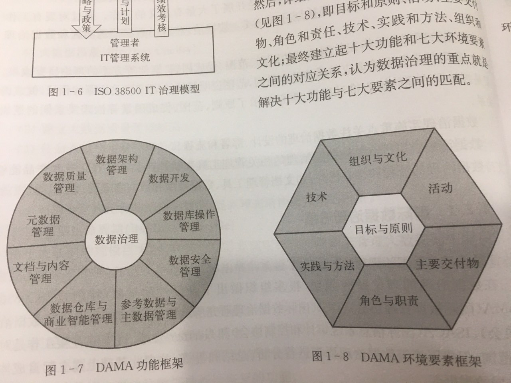
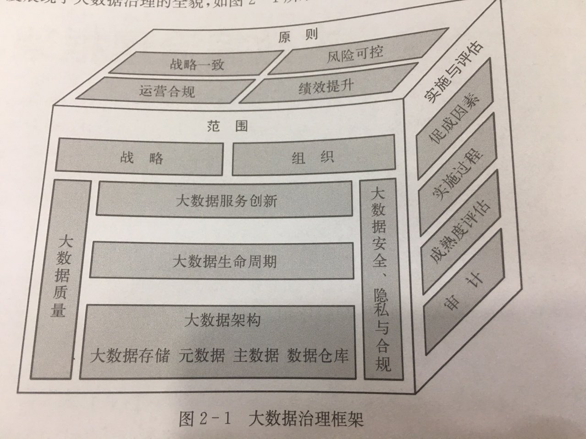
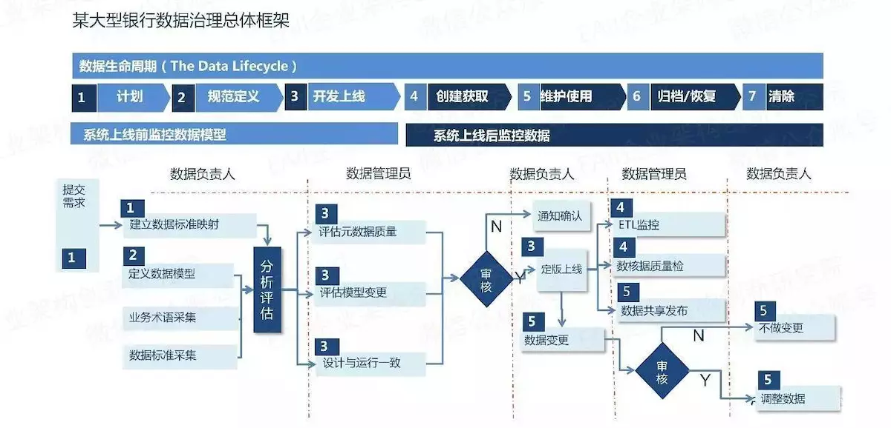

# 大数据治理

## 基本概念

大数据基本特征,区别于普通数据

* 数据量大
* 数据多样
* 产生速度极快
* 价值巨大

治理与管理的区别(来自COBIT5 定义)

类别 | 要点 | 主要活动
:--:|:--:|:--:
治理 | 评估利益相关者的需求、条件和选择以达成平衡一致的企业目标,然后根据方向和目标来监督绩效和合规 | 评估、指导和监督
管理 | 管理是指按照治理机构设定的方向开展计划、建设、运营和监控活动，以实现企业目标 | 计划，建设，运营和监控

## 数据治理的定义

* DMBOK,数据治理:是指对数据资产管理行驶权利和控制的活动集合(计划、监督、执行)
* COBIT5(ISO 38500),信息治理(数据治理是其一部分)包含以下三个方面的内容
  1. 确保信息利益相关者的需求、条件和选择得到评估以达成平衡一致的企业目标
  2. 确保通过优先排序和决策机制为信息管理职能设定方向
  3. 确保基于成成一致方向和目标对信息资源的绩效和合规进行监督
* DGI,数据治理是针对信息相关过程的决策权和职责体系,这些过程遵循"在什么时间和情况下、用什么方式、由谁、对哪些数据、采取哪些行动"的方法来执行

数据治理的基本概念(结合DGI,COBIT5,DMBOK定义进行概念内涵解读)

1. 明确数据治理的目标(数据资产[ 贵阳大数据交易所 ],数据即服务DAAS)
2. 理解数据治理的职能,它是评估，指导和监督
3. 把握数据治理的核心: 数据资产管理的决策权分配和职责分工是数据治理的核心
4. 数据治理必须遵循过程和遵守规范

综上所述,数据治理本质上就是:对企业的数据管理和利用进行评估,指导和监督,通过提供不断创新的数据服务,为企业创造价值.

* DAMA认为数据治理是对数据资产管理形式权利和控制,包括规划监控和执法。它包含了10大功能

## 数据治理的实施方法

数据治理实施必须注重项目管理，从而指导治理项目顺利实施.DGI,IBM,Gartner和ISACA实施方法存在一定差异,但都基本遵循了项目管理的生命周期

类别 | 要点
:--:|:--:
DGI | 建立数据治理的价值目标、设计路线图、制定计划、设计方案、实施方案、治理数据、监控测量
ISACA | 实施生命周期的七个阶段:评估有效性、发起项目、定义问题和机会、定义路线图、规划方案、执行计划、实施收益

基本形成了一致的数据治理逻辑。活动和流程 -> 关键域和促成要素 -> 目标和战略

数据治理是大数据治理的基础.大数据本质上也是数据,是数据存在和发展的一个新阶段,所以大数据治理本质上也是数据治理.但是他们的关注点不同.

* 前者提供数据管理和应用框架、策略和方法,目的是保证数据的准确性、一致性和可访问性.
* 后者强调发挥数据的应用价值,通过优化和提升数据的架构、质量和安全,推动数据的服务创新和价值创造

## 《大数据治理》桑尼尔.索雷斯 提出的大数据治理定义

大数据治理是广义信息治理计划的一部分,即指定与大数据有关的数据优化、隐私保护与数据变现的策略,它通过协调多个职能部门的目标来指定在大数据优化、隐私和数据货币化相关的策略。

该定义可以从六个方面进一步解读

1. 大数据治理应该纳入现有的信息治理框架内
2. 大数据治理的工作就是指定策略
3. 大数据必须被优化
4. 大数据的隐私保护很重要
5. 大数据必须被货币化，即创造商业价值
6. 大数据治理必须协调好多个职能部门的目标和利益

该定义提出了大数据治理的重点关注领域,即大数据优化和隐私保护,以及服务所创造的商业价值;但有以下不足

1. 认为大数据治理的方法就是指定策略,这一提法显然不够全面
2. 没有将大数据治理提升到体系框架的高度

## 《大数据治理与服务》 定义

大数据治理是对组织的大数据管理和利用进行评估、指导和监督的体系框架。它通过指定战略方针、建立组织架构、明确职责分工等，实现大数据的风险可控、安全合规、绩效提升和价值创造哦，并提供不断创新的大数据服务。

将从2个方面来解释大数据治理的概念内涵

1. 需要在哪些领域做出大数据治理的决策
   1. 大数据治理框架由三个子框架组成,即原则子框架、范围子框架、实施和评估子框架,它们包含了大数据治理的范围与评估方法论
   2. 范围子框架包含了六个关键域:战略、组织、大数据质量、大数据生命周期、大数据安全隐私与合规、大数据架构这6个关键域进行决策
2. 大数据治理的最终目标是什么
   1. 人们为什么要投入那么多的人力物力来研究大数据,回答是大数据能够为人类提供以"决策和预测支持"为代表的各种不断创新的大数据服务
   2. 一个组织内,大数据治理能够在提升大数据各项技术指标的同时,产生一系列创新的大数据服务,并创造出商业和社会价值.这既是大数据治理和数据治理的根本区别,也是大数据治理的最终目标

### 范围子框架

#### 战略

大数据环境下,大数据战略的定义和规划与传统的数据战略存在一定的差异。大数据战略的治理活动主要包括

1. 培养大数据的战略思维和价值驱动文化
2. 评估大数据治理能力,包括业务战略是否考虑了大数据当前与未来的能力要求,从资源技术支持等方面评估是否能支撑组织实现大数据战略转型

#### 组织

大数据治理组织的设立应该因组织情况不同而不同

1. 根据组织的业务情况，建立大数据组织的职责分配模型(RACI)
2. 扩展传统数据治理章程范围,明确大数据治理的相关职责和角色
3. 扩展传统数据治理委员会的成员角色和职责,将大数据利益相关者和大数据专家纳入进来
4. 扩展IT治理及传统数据治理的角色，增加大数据治理的职责和角色

#### 大数据质量

大数据治理计划主要采用以下方法来解决大数据质量问题:

1. 建立大数据质量度量维度
2. 建立大数据质量管理框架
3. 任命大数据质量管理负责人
4. 开发质量需求矩阵(包括关键数据元素、数据质量问题和业务规划等)
5. 利用半结构化和非结构化数据，提高稀疏结构化数据的质量

#### 大数据生命周期

由于大数据规模巨大,大数据治理需要制定特殊的规则来管理大数据的生命周期,来降低法律风险和IT开销.大数据的生命周期管理应该重点关注以下几个方面:

1. 明确大数据采集的范围、策略和规范
2. 扩展保存期限表,将大数据纳入其中
3. 针对不同热度的大数据,采用不同的存储和备份策略
4. 管理实时流数据的生命周期

#### 大数据架构

* 大数据存储
* 元数据
* 主数据
* 数据仓库

#### 大数据安全/隐私/合规

大数据安全/隐私/合规管理是指通过规划、指定和执行大数据安全规范和策略,确保大数据资产在使用过程中具有适当的认证、授权、访问和审计等控制措施。

* 大数据安全体现在数据安全不泄露,对访问者进行认证、授权、访问审计
* 隐私体现在数据需要对用户隐私数据进行加密处理
* 合规体现在数据在全生命周期是符合国家法律与监管要求规范的

#### 大数据服务创新

## 当前国际中的大数据治理规范

* ISO/IEC 38500 : 信息治理(数据治理)规范

* ISO 8000 : 数据质量规范

## 具体实施

1. 战略定义: 数据资产与服务输出(定义数据资产)
2. 数据全生命周期定义
   1. 公司全部关系型数据表的元数据一次性导入我们元数据仓库(生命周期的一部分)
   2. 建立生命周期规范
3. 数据治理评估监督体系建设
4. 数据质量中心

## MVP版本

1. 数据治理,大数据治理概念, 附加当前ISO对应标准
2. 基于大数据治理架构的MVP方案
3. 基于我们现在情况在MVP方案中的可执行单元与单位

### 数据治理与大数据治理概念

《大数据治理》桑尼尔.索雷斯 提出的大数据治理定义 与 《大数据治理与服务》定义

* ISO/IEC 38500 : 信息治理(数据治理)规范
* ISO 8000 : 数据质量规范

### 基于上述架构的MVP方案

#### 大数据治理的范围与实施

**战略**: 金融数据资产公司
**组织**: 大数据治理委员会,由各个部门核心成员参与,业务部门,开发部门,数据部门

**大数据基础架构**: 元数据,大数据存储,大数据实时与离线计算,数据仓库, 大致可以分三层

* 大数据资源管理层(存储资源,计算资源)
* 大数据管理与分析层(元数据,数仓,大数据实时与离线计算)
* 大数据应用与服务层(使用数据访问来调用)

**大数据生命周期**

* 所有的数据将进入这个流程中,即使是流计算任务产生的结果数据也将进入评估体系中
* 经过这个体系流程的数据都将明确其元数据(技术元数据与业务元数据),也将确定其整个生命流程,什么时候存储在什么地方,什么时候被销毁
* 现在计算任务生成的数据是没有整体进入流程化管理的
* 如何设计一个架构来完整实施数据生命周期管理?

**大数据质量**: ISO9000对质量的定义是一组固有特征满足要求的程度,其实就是其“适合性”,可以定义为"大数据合乎需求的程度"

* 从定义上来讲,数据的质量是需求驱动的,常规来说,数据的全生命周期都要保证其质量要求,数据存储,数据分析都有质量要求.
* 质量由需求定义,由需求方来反馈驱动其质量升级,收集阶段数据质量在数据生命周期开始时就已经定义好
* 工程实施方面,表达式解析可选 Apache Jakarta Jexl,IKExpression,ScriptEngine;或者自定义操作符, >=,>,<,is null

**大数据安全隐私合规**: 大数据安全/隐私/合规管理是指通过规划、指定和执行大数据安全规范和策略,确保大数据资产在使用过程中具有适当的认证、授权、访问和审计等控制措施。

* 大数据安全体现在数据安全不泄露,对访问者进行认证、授权、访问审计
* 隐私体现在数据需要对用户隐私数据进行加密处理
* 合规体现在数据在全生命周期是符合国家法律与监管要求规范的
* 可以构建大数据安全中心,专门检测数据平台中硬件与数据安全问题,隐私与合规问题也将在这个平台进行定义实现

#### 大数据治理的评估

独立第三方的审计通过对整个过程进行综合检查与评价,完成对整个大数据治理过程的评估.其可以客观评价大数据治理过程的成果与风险,提交组织大数据治理水平,满足社会和行业监管的需要,也开辟了全新的审计领域.

大致包含了以下内容(类似于checklist,不过是规范化的第三方审计,周期性check)

* 战略一致审计: 大数据治理战略是否符合企业战略的评价
* 风险可控审计: 是否明确了风险偏好及风险容忍程度;是否建立风险管理机制
* 运营合规审计: 是否根据法律法规对大数据要求建立合规管理机制
* 绩效提升审计: 是否制定了大数据治理绩效相关的方针及目标
* 大数据组织审计: 是否建立了大数据治理组织架构····
* 大数据架构审计: 是否满足业务发展的要求
* 大数据质量管理审计: 是否建立大数据质量管理机制;是否制定了大数据相关质量管理策略和原则;是否制定大数据质量管理流程与持续监控
* 大数据安全与隐私管理: 是否建立大数据安全与隐私管理机制;是否制定了相关方针与目标
